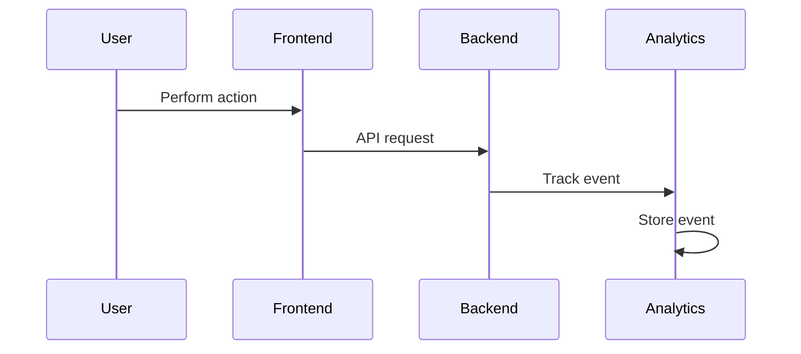
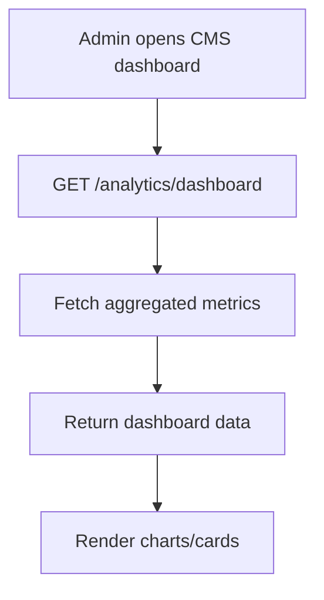
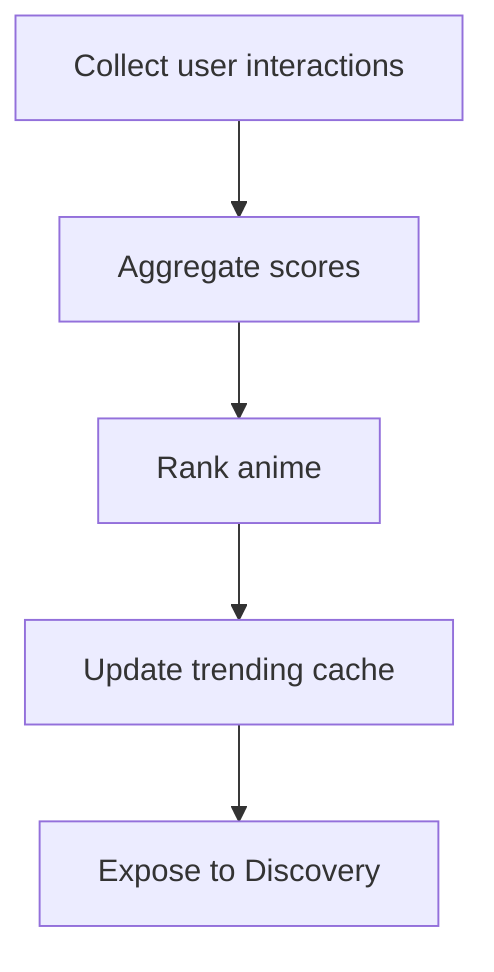
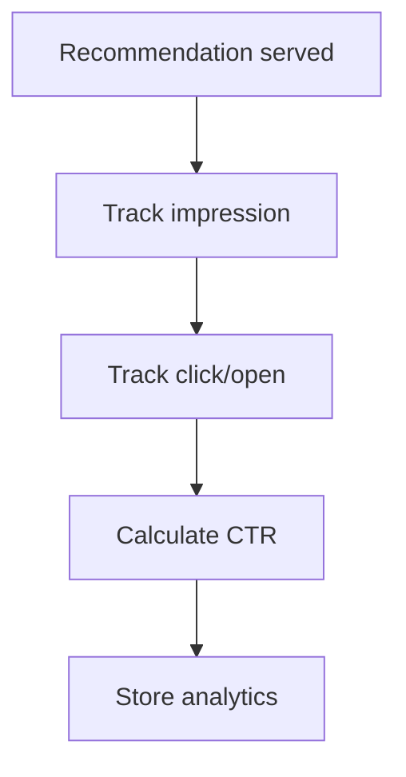

# Analytics Module

## 1. Overview

The Analytics module is responsible for collecting, processing, aggregating, and visualizing platform activity and user behavior across both the application and CMS.

- What problem it solves:
  Provides insights into user engagement, anime popularity, platform growth, and operational performance.

- Where it is used:
  Backend (event tracking & aggregation), Frontend (analytics-driven sections), CMS (dashboards & reports)

- Why it exists:
  To enable data-driven product decisions, improve recommendations, monitor platform health, and support business growth.

---

## 2. Scope

### Included

- User activity tracking
- Anime engagement analytics
- Discovery analytics
- Recommendation analytics
- Notification analytics
- CMS dashboards
- Trend aggregation
- Real-time metrics (optional)
- Event tracking system

### Excluded

- Third-party ad analytics
- Financial/accounting analytics
- External BI tooling integration
- Machine learning pipelines

---

## 3. User Flows

### Flow 1: User Activity Tracking



---

### Flow 2: CMS Dashboard Load



---

### Flow 3: Trending Anime Calculation



---

### Flow 4: Recommendation Analytics



---

## 4. Data Models (Schema)

### Tables

#### analytics_events

| Field       | Type      | Description                           |
| ----------- | --------- | ------------------------------------- |
| id          | UUID      | Primary key                           |
| user_id     | UUID      | Optional FK → users.id                |
| event_type  | String    | Event name                            |
| entity_type | String    | anime / recommendation / notification |
| entity_id   | UUID      | Related entity                        |
| metadata    | JSON      | Additional event data                 |
| created_at  | Timestamp | Event timestamp                       |

---

#### anime_trending_scores

| Field         | Type      | Description      |
| ------------- | --------- | ---------------- |
| anime_id      | UUID      | FK → anime.id    |
| score         | Float     | Trending score   |
| rank          | Integer   | Trending rank    |
| calculated_at | Timestamp | Last calculation |

---

#### recommendation_analytics

| Field       | Type      | Description        |
| ----------- | --------- | ------------------ |
| id          | UUID      | Primary key        |
| user_id     | UUID      | FK → users.id      |
| anime_id    | UUID      | Recommended anime  |
| impressions | Integer   | Times shown        |
| clicks      | Integer   | Times clicked      |
| ctr         | Float     | Click-through rate |
| updated_at  | Timestamp | Last updated       |

---

#### notification_analytics

| Field           | Type      | Description           |
| --------------- | --------- | --------------------- |
| id              | UUID      | Primary key           |
| notification_id | UUID      | FK → notifications.id |
| delivered       | Boolean   | Delivery success      |
| opened          | Boolean   | Opened by user        |
| clicked         | Boolean   | User interaction      |
| updated_at      | Timestamp | Last updated          |

---

### Relationships

- User → many analytics events
- Anime → trending scores
- Notification → notification analytics
- Recommendation → recommendation analytics

---

## 5. API Endpoints (Backend)

### POST /analytics/events

- Track frontend/backend events

---

### GET /analytics/trending

- Return trending anime

---

### GET /analytics/recommendations

- Return recommendation analytics summary

---

### GET /analytics/dashboard

Returns:

```json
{
  "users": {},
  "anime": {},
  "engagement": {},
  "notifications": {}
}
```

---

### GET /analytics/users

- User growth metrics

---

### GET /analytics/anime

- Anime popularity metrics

---

### GET /analytics/notifications

- Notification delivery/open metrics

---

### GET /analytics/discovery

- Search and discovery metrics

---

## 6. Frontend Integration

### App Integration

#### Pages / Screens

- Home page
- Trending section
- Recommendation sections

---

#### Components

- Trending anime carousel
- Continue watching analytics
- Personalized ranking sections

---

#### State Management

- Trending data
- Recommendation metrics
- Engagement-driven sections

---

#### API Usage

- GET /analytics/trending
- POST /analytics/events

---

### CMS Integration

#### Pages / Screens

- Analytics dashboard
- User analytics page
- Anime analytics page
- Notification analytics page

---

#### Components

- KPI cards
- Charts/graphs
- Data tables
- Time filters
- Heatmaps (future)

---

#### State Management

- Dashboard filters
- Analytics ranges
- Real-time metrics

---

#### API Usage

- GET /analytics/dashboard
- GET /analytics/users
- GET /analytics/anime
- GET /analytics/notifications

---

## 7. CMS Integration

### CMS Capabilities

- View platform metrics
- Monitor user growth
- Monitor anime performance
- Track notification effectiveness
- Analyze recommendation performance

### CMS Views

- Daily active users dashboard
- Trending anime dashboard
- Recommendation performance charts
- Notification engagement charts

---

## 8. Business Logic

### Event Tracking Rules

- Events generated for:
  - Anime views
  - Search actions
  - Recommendation clicks
  - Notification opens
  - Library updates

---

### Trending Score Logic

Example calculation:

Trending Score =

- Views weight
- Watchlist additions weight
- Completion rate weight
- Recent engagement boost

---

### Recommendation Metrics

Track:

- Impression count
- Click-through rate
- Conversion rate
- Watch-start rate

---

### Notification Metrics

Track:

- Delivery success rate
- Open rate
- Click rate
- Failure rate

---

## 9. Real-Time Behavior

- Live CMS dashboards (optional)
- Real-time active users
- Live trending recalculation
- Streaming analytics pipeline (future)

---

## 10. Error Handling

### Common Errors

- Invalid analytics payload
- Missing event metadata
- Aggregation failure
- Dashboard timeout

### Response Format

```json
{
  "error": "message"
}
```

---

## 11. Security Considerations

- Validate analytics payloads
- Prevent event spam
- Rate limit analytics endpoints
- Restrict CMS analytics access
- Avoid storing sensitive user data
- Anonymize analytics where possiblew

---

## 12. Edge Cases

- Duplicate event submissions
- Offline event syncing
- Massive traffic spikes
- Bot-generated events
- Delayed aggregation jobs
- Partial analytics data

---

## 13. Dependencies

- Authentication module
- Anime module
- Discovery module
- Recommendation module
- Notification module
- UserAnime module
- CMS
- Queue/Job system

---

## 14. Future Enhancements

- AI-powered analytics insights
- Cohort analysis
- Retention analytics
- Session replay integration
- Funnel analysis
- A/B testing support
- Predictive trending
- External BI integrations
