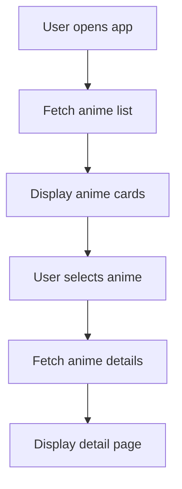
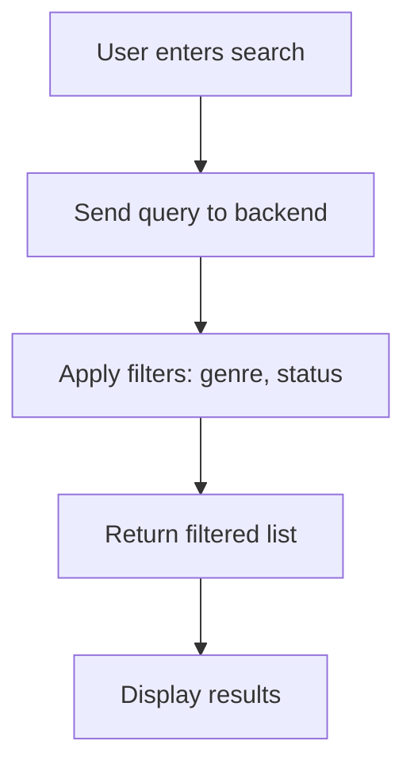

# Anime Module

## 1. Overview

The Anime module manages the global anime catalog used across the platform.

- What problem it solves:
  Provides a centralized source of anime data for browsing, discovery, and tracking.

- Where it is used:
  Frontend (listing, details), Backend (data layer), CMS (content management)

- Why it exists:
  To separate static anime data from user-specific interactions.

---

## 2. Scope

### Included

- Anime catalog
- Anime metadata (title, description, episodes)
- Genre relationships
- Filtering and querying

### Excluded

- User tracking
- Recommendations
- Notifications

---

## 3. User Flows

### Flow 1: Browse Anime

---

### Flow 2: Search / Filter Anime

---

## 4. Data Models (Schema)

### Tables

#### anime

| Field        | Type      | Description        |
| ------------ | --------- | ------------------ |
| id           | UUID      | Primary key        |
| title        | String    | Anime title        |
| description  | Text      | Synopsis           |
| cover_image  | String    | Image URL          |
| total_eps    | Integer   | Total episodes     |
| status       | String    | Airing / Completed |
| release_date | Date      | Release date       |
| created_at   | Timestamp | Created time       |

---

#### genres

| Field | Type   | Description |
| ----- | ------ | ----------- |
| id    | UUID   | Primary key |
| name  | String | Genre name  |

---

#### anime_genres

| Field    | Type | Description    |
| -------- | ---- | -------------- |
| anime_id | UUID | FK → anime.id  |
| genre_id | UUID | FK → genres.id |

---

### Relationships

- Anime ↔ Genres (many-to-many)

---

## 5. API Endpoints (Backend)

### GET /anime

- List anime (filters: genre, status, search)

### GET /anime/:id

- Get anime details

---

## 6. Frontend Integration

### Pages / Screens

- Home
- Anime list
- Anime detail page

---

### Components

- Anime card
- Anime grid
- Anime detail view
- Filters/search bar

---

### State Management

- Anime list state
- Selected anime details
- Filters

---

### API Usage

- Fetch list on page load
- Fetch details on click

---

## 7. CMS Integration

### CMS Capabilities

- Create/update/delete anime
- Manage genres
- Upload images

---

### CMS Views

- Anime table
- Anime editor
- Genre manager

---

## 8. Business Logic

- Anime must have unique ID
- Genres must exist before linking
- total_eps can be null (airing anime)

---

## 9. Real-Time Behavior

- Not required

---

## 10. Error Handling

- Anime not found
- Invalid filters

---

## 11. Security Considerations

- Public read access
- CMS requires admin auth

---

## 12. Edge Cases

- Missing episode count
- Duplicate genre mapping
- Empty search results

---

## 13. Dependencies

- CMS
