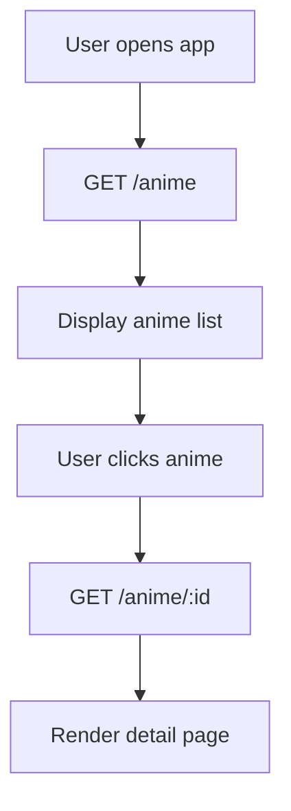
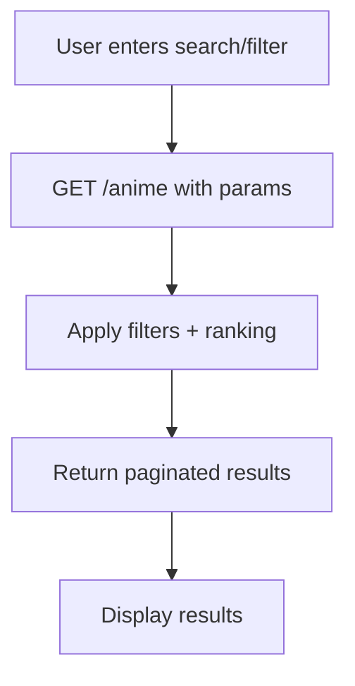
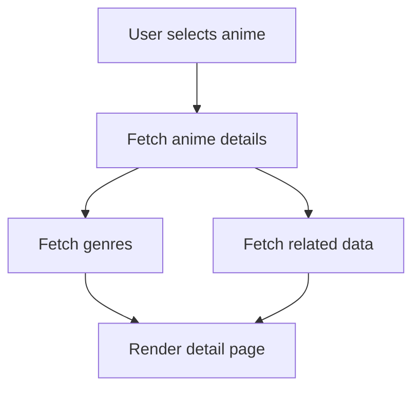

# Anime Module

## 1. Overview

The Anime module manages the global anime catalog used across the platform.

- **What problem it solves:**
  Provides a centralized, consistent source of anime data for all features (discovery, tracking, recommendations).

- **Where it is used:**
  - Frontend (listing, detail pages)
  - Backend (data layer, filtering, joins)
  - CMS (content creation & management)

- **Why it exists:**
  To separate **static anime data** from **user-specific interactions**, ensuring modular and scalable architecture.

---

## 2. Scope

### Included

- Anime catalog management
- Anime metadata (title, description, episodes, status)
- Genre relationships
- Search, filtering, sorting, pagination
- Popularity & ranking data
- Airing/episode tracking

### Excluded

- User tracking (UserAnime module)
- Recommendations (Recommendation module)
- Notifications (Notification module)

---

## 3. User Flows

### Flow 1: Browse Anime



---

### Flow 2: Search / Filter Anime



---

### Flow 3: View Anime Details



---

## 4. Data Models (Schema)

### Tables

#### anime

| Field             | Type      | Description                      |
| ----------------- | --------- | -------------------------------- |
| id                | UUID      | Primary key                      |
| title             | String    | Anime title                      |
| slug              | String    | URL-friendly unique identifier   |
| description       | Text      | Synopsis                         |
| cover_image       | String    | Image URL                        |
| total_eps         | Integer   | Total episodes (nullable)        |
| current_eps       | Integer   | Latest released episode          |
| status            | String    | Airing / Completed               |
| release_date      | Date      | Initial release date             |
| next_episode_date | Timestamp | Next episode release (if airing) |
| popularity_score  | Float     | Internal ranking metric          |
| rating_avg        | Float     | Average rating                   |
| rating_count      | Integer   | Number of ratings                |
| created_at        | Timestamp | Created time                     |
| updated_at        | Timestamp | Last updated                     |

---

#### genres

| Field | Type   | Description |
| ----- | ------ | ----------- |
| id    | UUID   | Primary key |
| name  | String | Genre name  |

---

#### anime_genres

| Field    | Type | Description    |
| -------- | ---- | -------------- |
| anime_id | UUID | FK → anime.id  |
| genre_id | UUID | FK → genres.id |

---

### Relationships

- Anime ↔ Genres (many-to-many)
- Anime → UserAnime (one-to-many)
- Anime → Recommendation (indirect dependency)

---

### Indexing Strategy

- Index on `title` (search)
- Index on `slug` (lookup)
- Index on `status`
- Index on `popularity_score`
- Composite index on `anime_genres.genre_id`

---

## 5. API Endpoints (Backend)

### GET /anime

Fetch anime list with filtering and pagination

**Query Params:**

- `search` (string)
- `genre` (id)
- `status` (airing/completed)
- `sort` (popularity, rating, latest)
- `page` (int)
- `limit` (int)

**Example:**

```http
GET /anime?search=naruto&genre=action&sort=popularity&page=1&limit=20
```

---

### GET /anime/:id

- Get detailed anime information

---

### GET /anime/slug/:slug

- Fetch anime using slug (SEO-friendly)

---

## 6. Frontend Integration

### Pages / Screens

- Home (via Discovery)
- Anime listing page
- Anime detail page

---

### Components

- Anime card
- Anime grid/list
- Anime detail view
- Filter panel
- Search bar

---

### State Management

- Anime list state
- Selected anime detail
- Filters & pagination state

---

### API Usage

- `/anime` → list view
- `/anime/:id` → detail page
- Called on:
  - Page load
  - Filter/search interaction

---

## 7. CMS Integration

### CMS Capabilities

- Create / update / delete anime
- Manage genres
- Upload & manage images
- Set popularity/trending flags
- Bulk import (future)
- Draft vs published state (future)

---

### CMS Views

- Anime table (list view)
- Anime editor form
- Genre manager

---

## 8. Business Logic

- Anime must have a unique `slug`
- Genres must exist before linking
- `total_eps` can be null for airing anime
- `current_eps ≤ total_eps` (if known)
- Prevent duplicate genre mappings
- Ranking influenced by:
  - Popularity score
  - Ratings
  - Recency

---

## 9. Real-Time Behavior

- Not required (V1)

### Future Enhancements

- Episode updates triggering:
  - Notifications
  - Cache refresh

- Scheduled updates for airing anime

---

## 10. Error Handling

### Common Errors

- Anime not found
- Invalid filters
- Invalid query params

### Response Format

```json
{
  "error": "message"
}
```

---

## 11. Security Considerations

- Public read access
- CMS requires admin authentication
- Input validation on filters/search
- Rate limiting on search endpoints

---

## 12. Edge Cases

- Anime with unknown episode count
- Airing anime with irregular schedules
- Duplicate entries (same title)
- Empty search results
- Large datasets (requires pagination)

---

## 13. Dependencies

- CMS module
- Database
- Discovery module (consumer)
- Recommendation module (consumer)
- UserAnime module (consumer)

---

# ✅ Final Note

This version is now:

- **MVP-ready** ✅
- **Scalable** ✅
- **Aligned with your system architecture** ✅
