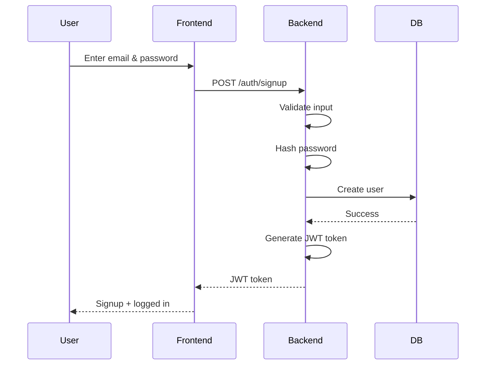
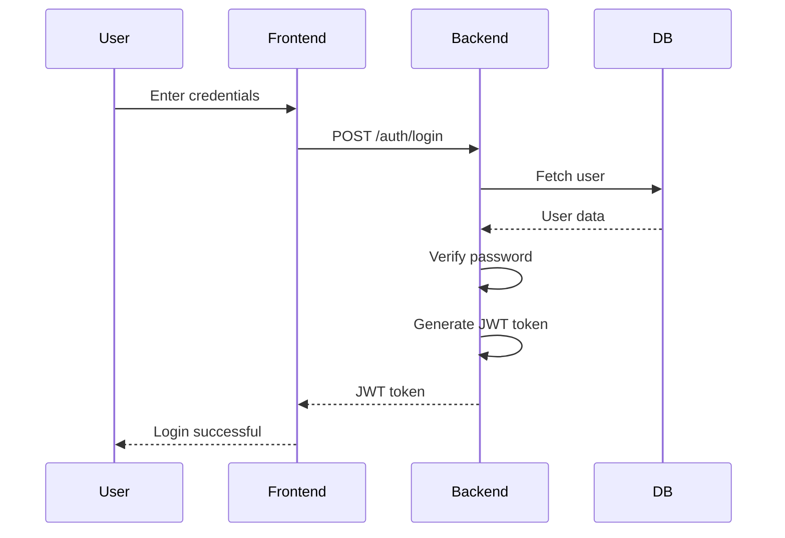
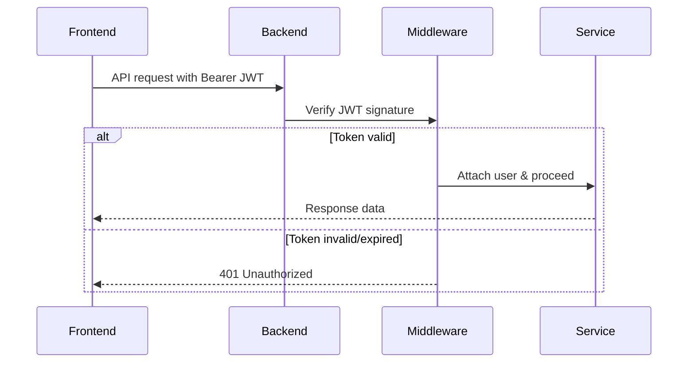
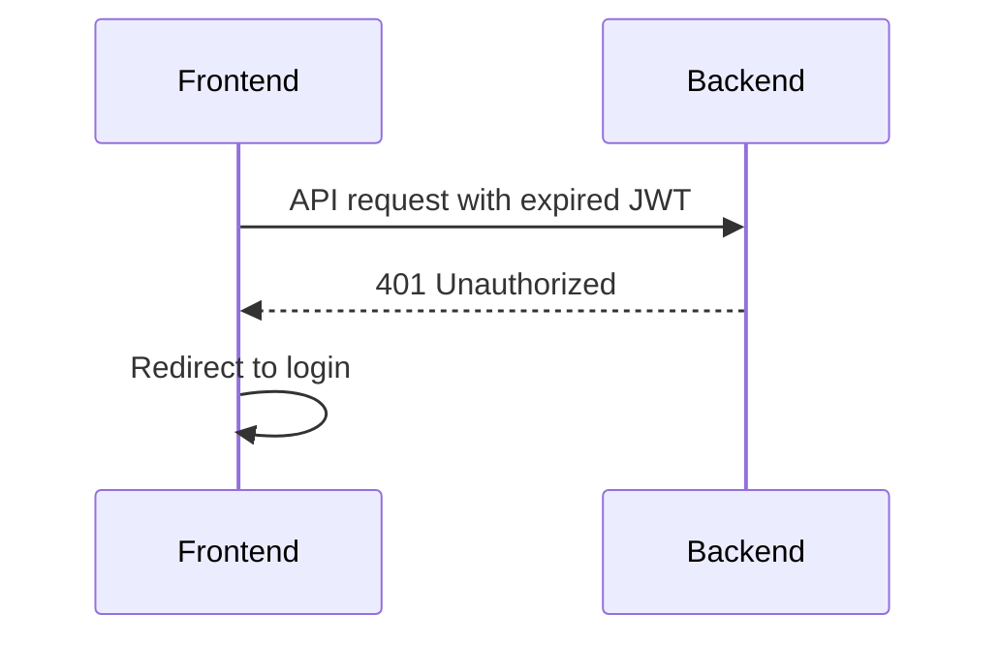
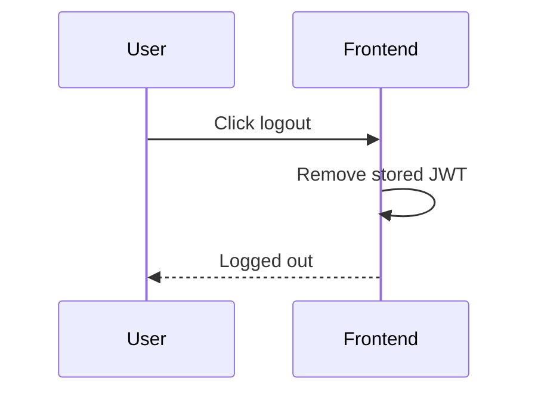

# Authentication Module

## 1. Overview

The Authentication module is responsible for verifying user identity and managing secure access using stateless JWT-based authentication.

- What problem it solves:  
  Prevents unauthorized access and ensures only valid users can access protected features.

- Where it is used:  
  Frontend (login/signup/token handling), Backend (JWT validation), CMS (admin access)

- Why it exists:  
  To provide a scalable, stateless authentication system without server-side session storage.

---

## 2. Scope

### Included

- User signup and login
- Password hashing and validation
- JWT access token generation
- Automatic login after signup (JWT issued on signup)
- Auth middleware for token validation

### Excluded

- Server-side session storage
- Role-based access control
- User profile management
- OAuth/social login (if separate)

---

## 3. User Flows

### Flow 1: User Signup (Auto Login)



---

### Flow 2: User Login



---

### Flow 3: Authenticated Request



---

### Flow 4: Token Expiry Handling



---

### Flow 5: Logout



---

## 4. Data Models (Schema)

### Tables

#### users

| Field      | Type      | Description     |
| ---------- | --------- | --------------- |
| id         | UUID      | Primary key     |
| email      | String    | Unique email    |
| password   | String    | Hashed password |
| created_at | Timestamp | Created time    |
| updated_at | Timestamp | Updated time    |

---

### Relationships

- Users connect to other modules (anime tracking, etc.)

---

## 5. API Endpoints (Backend)

### POST /auth/signup

- Register user and return JWT (auto-login)

### POST /auth/login

- Authenticate user and return JWT

### GET /auth/me

- Get current user (via JWT)

---

## 6. Frontend Integration

### Pages / Screens

- Login page
- Signup page
- Protected dashboard

### Components

- Login form
- Signup form
- Auth guard

### State Management

- Auth state (logged in/out)
- User data
- JWT token (stored in memory or HTTP-only cookie)

### API Usage

- /auth/signup → returns JWT
- /auth/login → returns JWT
- /auth/me

---

## 7. CMS Integration

### CMS Capabilities

- View users
- Block/unblock users
- Reset passwords

### CMS Views

- User list
- User details
- Admin actions

---

## 8. Business Logic

- Email must be unique
- Password strength validation
- Password hashing using bcrypt/argon2
- JWT generation on:
  - Signup
  - Login
- Token verification on every request

---

## 9. Real-Time Behavior

- Token expiry forces re-authentication
- Optional: silent refresh (future enhancement)

---

## 10. Error Handling

### Common Errors

- Invalid credentials
- User already exists
- Token expired
- Unauthorized

### Response Format

```json
{
  "error": "message"
}
```

---

## 11. Security Considerations

- Password hashing (bcrypt/argon2)
- JWT signed securely (secret/private key)
- Short-lived tokens recommended
- Store JWT in HTTP-only cookies (preferred over localStorage)
- Rate limiting on login/signup
- Protection against:
  - Brute force attacks
  - Token tampering
  - XSS

---

## 12. Edge Cases

- Duplicate email signup
- Expired token during active use
- Token tampering
- Multiple device login (stateless handling)

---

## 13. Dependencies

- Database (users table)
- JWT library
- Encryption library (bcrypt/argon2)
- Middleware system
