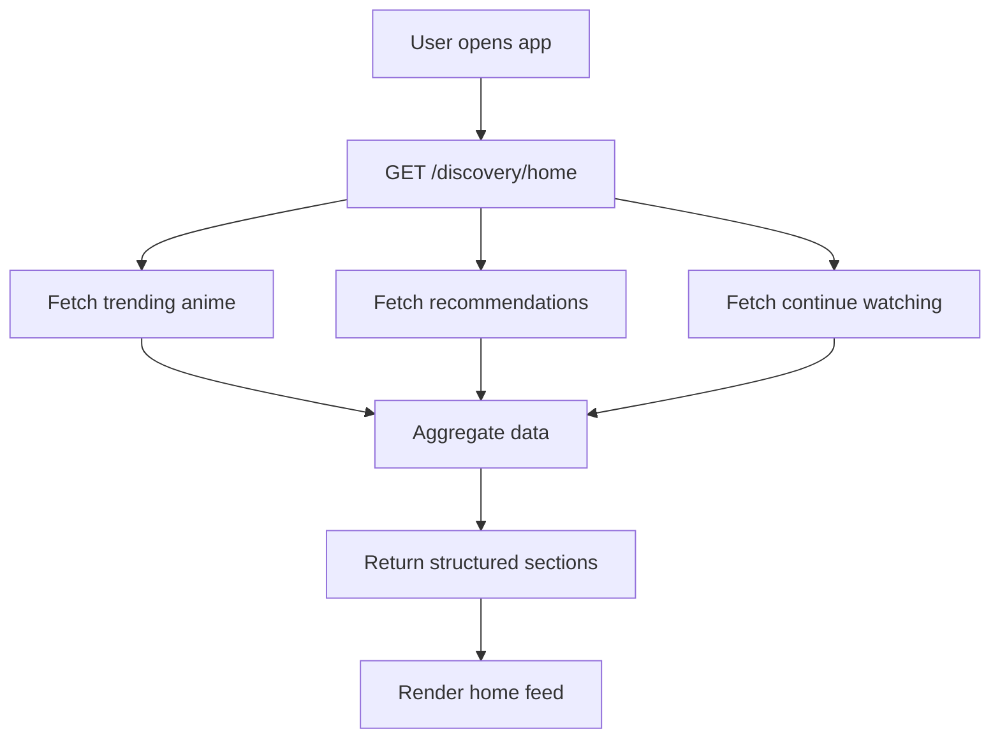
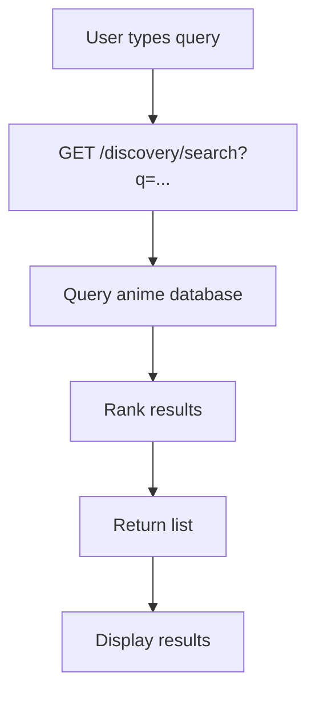
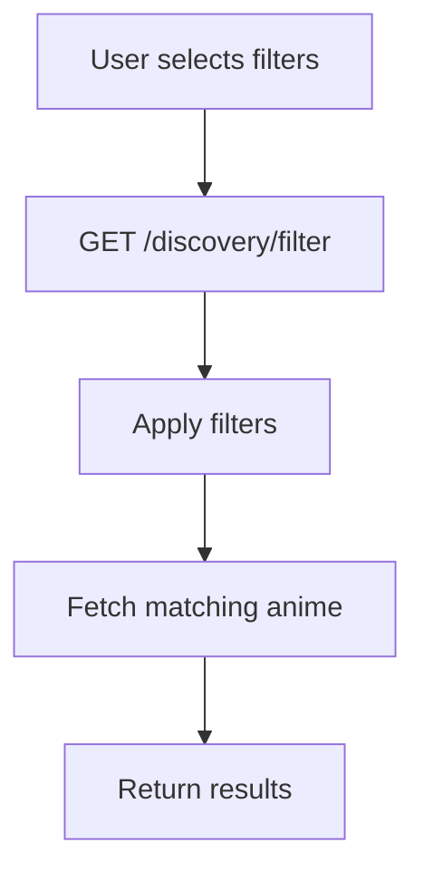
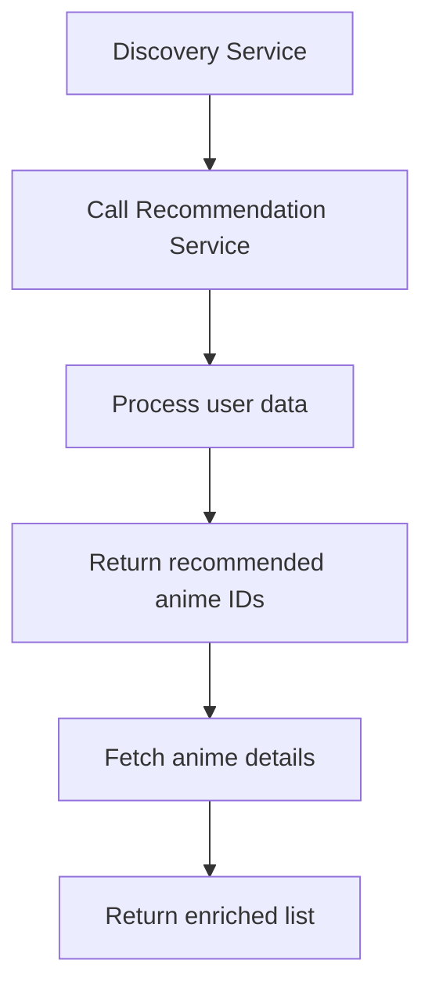

# Discovery Module

## 1. Overview

The Discovery module is responsible for enabling users to explore anime through search, filtering, trending content, and personalized recommendations.

- What problem it solves:
  Helps users discover relevant anime efficiently instead of browsing blindly.

- Where it is used:
  Frontend (home, search, explore), Backend (aggregation layer), integrates with Recommendation module

- Why it exists:
  To provide a unified interface for both query-based discovery and personalized content delivery.

---

## 2. Scope

### Included

- Search anime
- Filter anime (genre, status, etc.)
- Trending / popular anime
- Personalized sections (via recommendation service)
- Aggregated discovery endpoints

### Excluded

- Core recommendation algorithms (handled separately)
- Anime data management
- User tracking logic

---

## 3. User Flows

### Flow 1: Open Home (Discovery Feed)



---

### Flow 2: Search Anime



---

### Flow 3: Filter / Explore



---

### Flow 4: Personalized Recommendations (via Discovery)



---

## 4. Data Models (Schema)

### No direct tables

The Discovery module is an **aggregation layer**.

### Uses:

- anime (from Anime module)
- user_anime (from UserAnime module)
- genres

---

## 5. API Endpoints (Backend)

### GET /discovery/home

Returns structured home feed:

```json
{
  "sections": [
    { "type": "trending", "items": [] },
    { "type": "recommended", "items": [] },
    { "type": "continue_watching", "items": [] }
  ]
}
```

---

### GET /discovery/search?q=

- Search anime by title

---

### GET /discovery/filter

Query params:

- genre
- status
- sort

---

### GET /discovery/recommended

- Returns personalized recommendations

---

## 6. Frontend Integration

### Pages / Screens

- Home page
- Search page
- Explore page

---

### Components

- Section rows (horizontal scroll)
- Search bar
- Filter panel
- Anime cards

---

### State Management

- Discovery feed state
- Search results
- Filters
- Recommendation sections

---

### API Usage

- /discovery/home → on app load
- /discovery/search → on input
- /discovery/filter → on filter change

---

## 7. CMS Integration

### CMS Capabilities

- Mark anime as trending
- Manage featured sections (optional)

---

### CMS Views

- Trending control panel
- Featured content editor

---

## 8. Business Logic

- Home feed is composed of multiple sections
- Order of sections is configurable
- Recommendation section depends on user data
- Fallback:
  - If no user data → show popular anime

---

## 9. Real-Time Behavior

- Optional:
  - Trending updates periodically
  - Cache refresh strategies

---

## 10. Error Handling

### Common Errors

- Empty results
- Invalid filters
- Recommendation service failure

### Fallbacks

- Return trending instead of recommendations

---

## 11. Security Considerations

- Public access for browsing
- Personalized endpoints require authentication
- Rate limiting for search

---

## 12. Edge Cases

- New user (no history)
- No search results
- Large result sets (pagination required)
- Recommendation service timeout

---

## 13. Dependencies

- Anime module
- UserAnime module
- Recommendation service (internal/external)
