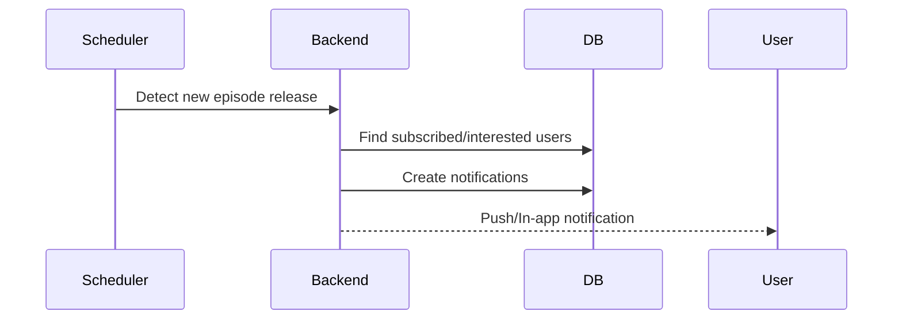
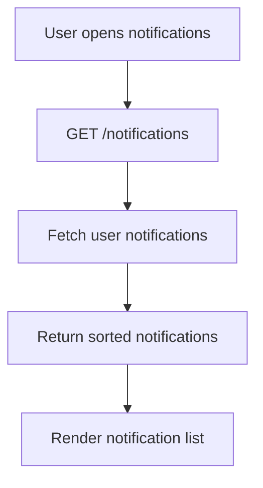
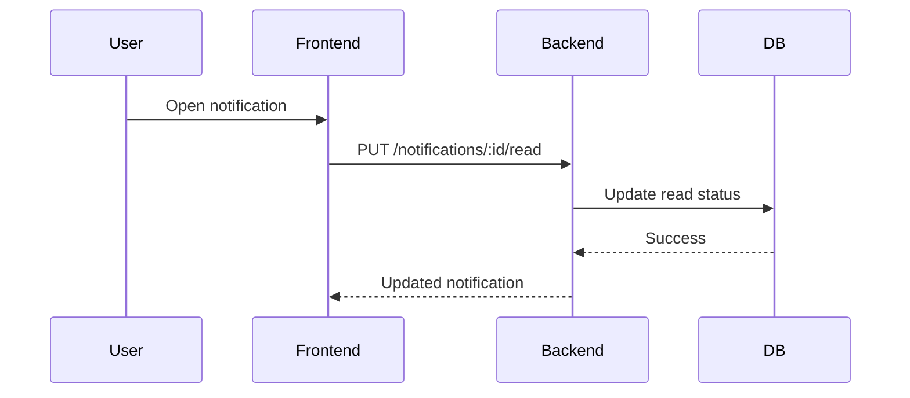
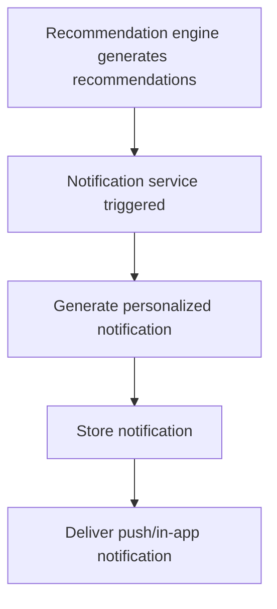
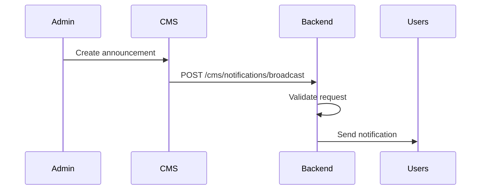

# Notification Module

## 1. Overview

The Notification module is responsible for delivering real-time and scheduled notifications to users about anime-related activity and platform events.

- What problem it solves:
  Keeps users engaged and informed about new episodes, anime updates, personalized alerts, and platform activity.

- Where it is used:
  Frontend (notification center, in-app alerts), Backend (notification service and delivery logic), CMS (notification management and broadcasting)

- Why it exists:
  To centralize notification generation, delivery, tracking, and user notification preferences.

---

## 2. Scope

### Included

- In-app notifications
- Push notification support
- Notification preferences
- Episode release notifications
- Personalized recommendation alerts
- System announcements
- Notification read/unread tracking
- Notification delivery logging

### Excluded

- Recommendation generation logic
- Anime metadata management
- Email marketing campaigns (future module)
- Real-time chat messaging

---

## 3. User Flows

### Flow 1: New Episode Notification



---

### Flow 2: User Opens Notification Center



---

### Flow 3: Mark Notification as Read



---

### Flow 4: Personalized Recommendation Alert



---

### Flow 5: CMS Broadcast Notification



---

## 4. Data Models (Schema)

### Tables

#### notifications

| Field      | Type      | Description                       |
| ---------- | --------- | --------------------------------- |
| id         | UUID      | Primary key                       |
| user_id    | UUID      | FK → users.id                     |
| type       | String    | episode / recommendation / system |
| title      | String    | Notification title                |
| message    | Text      | Notification body                 |
| anime_id   | UUID      | Optional FK → anime.id            |
| is_read    | Boolean   | Read status                       |
| created_at | Timestamp | Created time                      |
| read_at    | Timestamp | Read timestamp                    |

---

#### notification_preferences

| Field                        | Type      | Description                   |
| ---------------------------- | --------- | ----------------------------- |
| id                           | UUID      | Primary key                   |
| user_id                      | UUID      | FK → users.id                 |
| episode_notifications        | Boolean   | Episode alerts enabled        |
| recommendation_notifications | Boolean   | Recommendation alerts enabled |
| system_notifications         | Boolean   | System announcements enabled  |
| push_enabled                 | Boolean   | Push notifications enabled    |
| updated_at                   | Timestamp | Last updated                  |

---

#### notification_delivery_logs

| Field           | Type      | Description             |
| --------------- | --------- | ----------------------- |
| id              | UUID      | Primary key             |
| notification_id | UUID      | FK → notifications.id   |
| channel         | String    | in_app / push           |
| status          | String    | pending / sent / failed |
| error_message   | Text      | Optional failure reason |
| delivered_at    | Timestamp | Delivery timestamp      |

---

### Relationships

- User → many notifications
- User → one notification_preferences
- Notification → optional anime
- Notification → many delivery logs

---

## 5. API Endpoints (Backend)

### GET /notifications

- Fetch paginated user notifications

---

### GET /notifications/unread-count

- Get unread notification count

---

### PUT /notifications/:id/read

- Mark notification as read

---

### PUT /notifications/read-all

- Mark all notifications as read

---

### DELETE /notifications/:id

- Delete notification

---

### GET /notifications/preferences

- Fetch user notification preferences

---

### PUT /notifications/preferences

- Update notification preferences

---

### POST /cms/notifications/broadcast

- Send platform-wide announcement

---

## 6. Frontend Integration

### Pages / Screens

- Notification center
- Home page notification badge
- User settings page

---

### Components

- Notification dropdown
- Notification list item
- Unread badge
- Notification settings form

---

### State Management

- Notification list
- Unread count
- Notification preferences
- Real-time notification state

---

### API Usage

- GET /notifications on notification center open
- GET /notifications/unread-count periodically or via socket
- PUT /notifications/:id/read when opened
- PUT /notifications/preferences from settings page

---

## 7. CMS Integration

### CMS Capabilities

- Send broadcast announcements
- View delivery statistics
- Retry failed notifications
- Manage notification templates (future)

---

### CMS Views

- Broadcast notification form
- Notification analytics dashboard
- Delivery logs table

---

## 8. Business Logic

### Notification Types

#### 1. Episode Notifications

- Sent when new episodes are released
- Only delivered if user tracks anime
- Respect user preferences

#### 2. Recommendation Notifications

- Triggered from recommendation engine
- Personalized per user

#### 3. System Notifications

- Maintenance alerts
- Platform announcements
- Feature releases

---

### Delivery Rules

- Avoid duplicate notifications
- Notifications sorted newest first
- Respect notification preferences
- Failed deliveries logged for retry

---

### Read State Rules

- Notification marked read when opened
- Read timestamp stored
- Read-all updates all unread notifications

---

## 9. Real-Time Behavior

- Real-time in-app notification delivery
- WebSocket/SSE support for live updates
- Unread badge updates instantly
- Push notifications delivered asynchronously

---

## 10. Error Handling

### Common Errors

- Notification not found
- Unauthorized access
- Delivery failure
- Invalid preferences payload

### Response Format

```json
{
  "error": "message"
}
```

---

## 11. Security Considerations

- Requires JWT authentication
- Validate ownership of notifications
- Prevent notification spoofing
- Rate limit broadcast actions
- Restrict CMS broadcast access to admins
- Sanitize notification payloads

---

## 12. Edge Cases

- Duplicate episode events
- User disables notifications during queued delivery
- Push token invalidation
- Large-scale broadcasts
- Race conditions when marking notifications as read
- Offline users receiving delayed notifications

---

## 13. Dependencies

- Authentication module
- Anime module
- UserAnime module
- Recommendation module
- Discovery module
- CMS
- Push notification provider (Firebase/APNs/etc.)

---

## 14. Future Enhancements

- Email notifications
- Notification scheduling
- AI-prioritized notifications
- User-custom notification rules
- Digest notifications
- Multi-device sync
- Notification categories and filters
