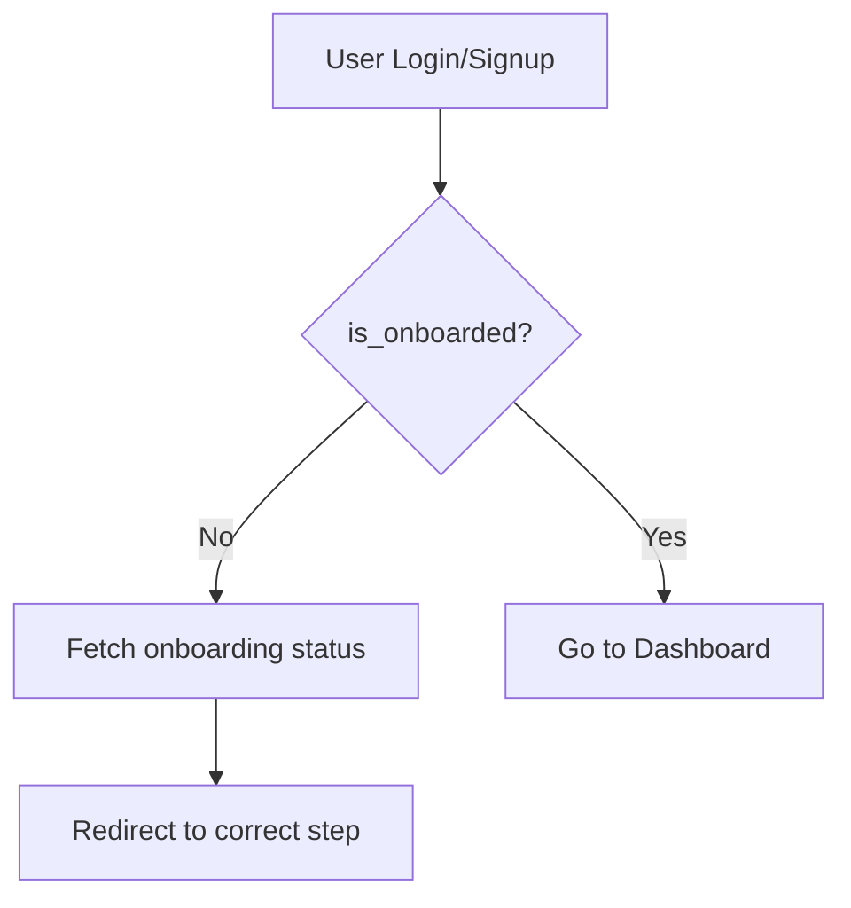
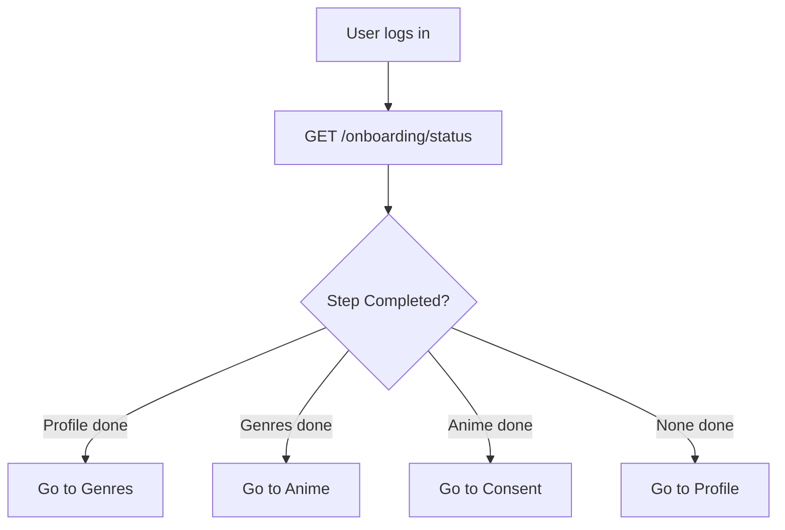
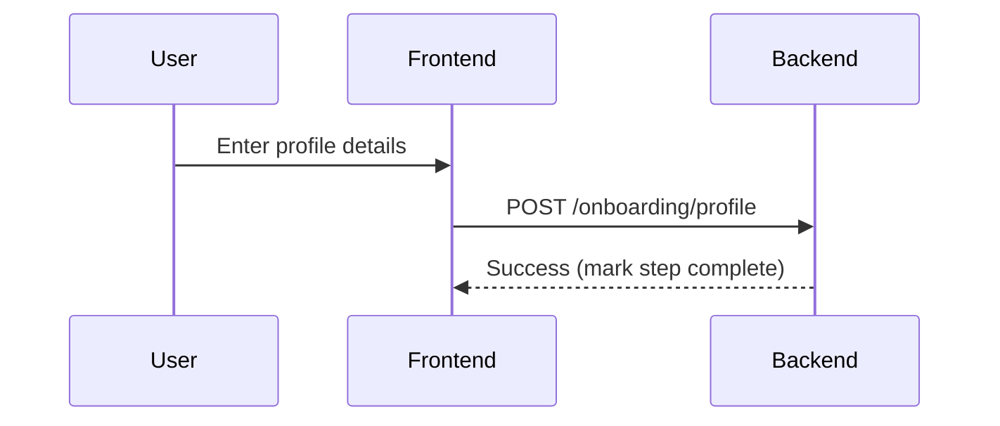
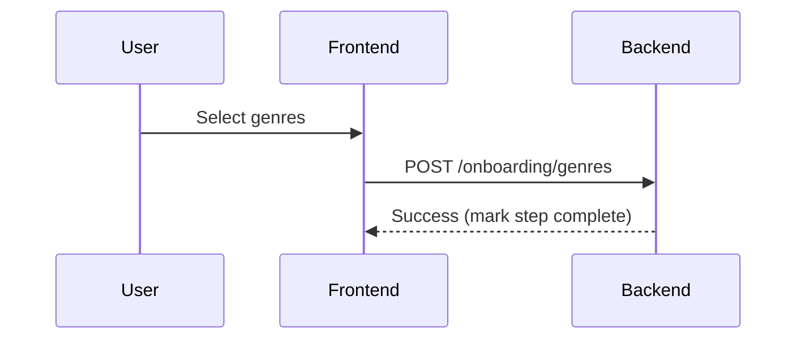
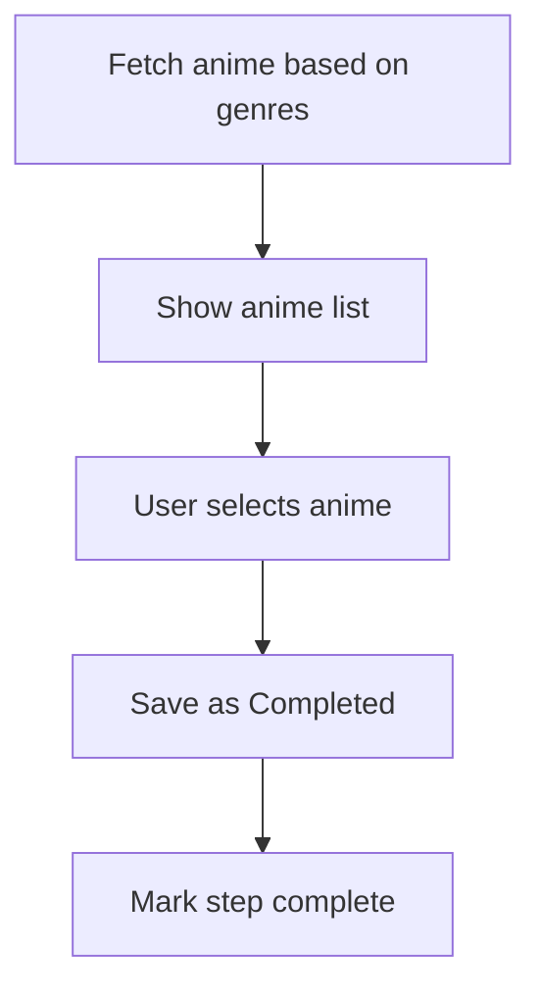
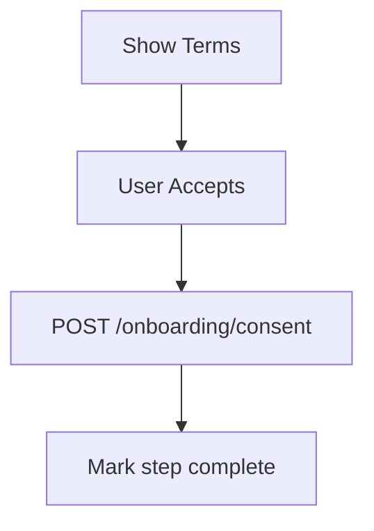
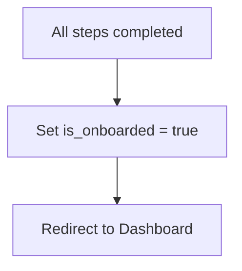

# User Onboarding Module

## 1. Overview

The User Onboarding module guides newly authenticated users through initial setup and basic personalization to improve engagement and recommendations.

- What problem it solves:  
  Prevents empty-state experience and ensures users provide minimum required data.

- Where it is used:  
  Frontend (onboarding flow), Backend (profile + genre relations), CMS (optional configuration)

- Why it exists:  
  To collect essential user data (profile, genres, watched anime, consent) and enable initial personalization.

---

## 2. Scope

### Included

- First-time onboarding flow (post-authentication)
- Step-based onboarding with persistence
- Profile setup (basic user info)
- Genre selection (relation-based)
- Initial watched anime selection (based on selected genres)
- Consent collection (terms/privacy)
- Resume onboarding from last completed step

### Excluded

- Recommendation engine logic
- Long-term behavior tracking
- Advanced profile editing

---

## 3. User Flows

### Flow 1: First Login → Onboarding Trigger



---

### Flow 2: Resume Progress Logic



---

### Flow 3: Step 1 - Profile Setup



---

### Flow 4: Step 2 - Genre Selection



---

### Flow 5: Step 3 - Watched Anime Selection



---

### Flow 6: Step 4 - Consent



---

### Flow 7: Completion



---

## 4. Data Models (Schema)

### Tables

#### users (update)

| Field        | Type    | Description                  |
| ------------ | ------- | ---------------------------- |
| is_onboarded | Boolean | Tracks onboarding completion |
| name         | String  | User display name            |

---

#### onboarding_progress

| Field        | Type      | Description                        |
| ------------ | --------- | ---------------------------------- |
| user_id      | UUID      | FK → users.id                      |
| current_step | String    | profile / genres / anime / consent |
| profile_done | Boolean   | Step completion flag               |
| genres_done  | Boolean   | Step completion flag               |
| anime_done   | Boolean   | Step completion flag               |
| consent_done | Boolean   | Step completion flag               |
| updated_at   | Timestamp | Last updated                       |

---

#### genres

| Field | Type   | Description |
| ----- | ------ | ----------- |
| id    | UUID   | Primary key |
| name  | String | Genre name  |

---

#### user_genres

| Field    | Type | Description    |
| -------- | ---- | -------------- |
| user_id  | UUID | FK → users.id  |
| genre_id | UUID | FK → genres.id |

---

#### user_anime

| Field      | Type      | Description   |
| ---------- | --------- | ------------- |
| id         | UUID      | Primary key   |
| user_id    | UUID      | FK → users.id |
| anime_id   | UUID      | FK → anime.id |
| status     | String    | Completed     |
| created_at | Timestamp | Created time  |

---

#### user_consents

| Field       | Type      | Description             |
| ----------- | --------- | ----------------------- |
| id          | UUID      | Primary key             |
| user_id     | UUID      | FK → users.id           |
| accepted_at | Timestamp | Consent acceptance time |
| version     | String    | Policy version          |

---

### Relationships

- One-to-one: User → OnboardingProgress
- One-to-many: User → UserGenres
- One-to-many: User → UserAnime
- One-to-one: User → Consent

---

## 5. API Endpoints (Backend)

### GET /onboarding/status

- Description: Returns onboarding progress and next step

```json
{
  "current_step": "genres",
  "completed": {
    "profile": true,
    "genres": false,
    "anime": false,
    "consent": false
  }
}
```

---

### POST /onboarding/profile

- Description: Save profile and mark step complete

---

### POST /onboarding/genres

- Description: Save genres and mark step complete

---

### GET /onboarding/anime

- Description: Fetch anime based on selected genres

---

### POST /onboarding/anime

- Description: Save watched anime and mark step complete

---

### POST /onboarding/consent

- Description: Save consent and mark step complete

---

### PUT /onboarding/complete

- Description: Finalize onboarding

---

## 6. Frontend Integration

### Pages / Screens

- Profile screen
- Genre selection
- Anime selection
- Consent screen

---

### Components

- Stepper (persistent progress)
- Profile form
- Genre selector
- Anime selector grid
- Consent checkbox

---

### State Management

- Current step (from backend)
- Step completion flags
- Persisted progress (synced with backend)

---

### API Usage

- GET /onboarding/status (on app start)
- Step APIs (profile/genres/anime/consent)
- PUT /onboarding/complete

---

## 7. CMS Integration

### CMS Capabilities

- Manage genres
- Manage anime catalog
- Manage consent/versioning

---

### CMS Views

- Genre table
- Anime management
- Consent control panel

---

## 8. Business Logic

- Onboarding consists of 4 required steps:
  1. Profile
  2. Genres
  3. Watched Anime
  4. Consent

- Each step is persisted independently
- User resumes from last incomplete step
- Cannot skip steps
- `is_onboarded = true` only after all steps completed

---

## 9. Real-Time Behavior

- Not required

---

## 10. Error Handling

### Common Errors

- Invalid data per step
- Step order violation
- Unauthorized request

### Response Format

```json
{
  "error": "message"
}
```

---

## 11. Security Considerations

- Requires JWT authentication
- Validate step order on backend (no skipping)
- Prevent duplicate inserts
- Rate limit onboarding APIs

---

## 12. Edge Cases

- App closed mid-step → resume correctly
- Multiple devices → sync progress
- Partial data saved but step incomplete
- Retry failed steps safely

---

## 13. Dependencies

- Authentication module
- Genre module
- Anime module
- CMS
