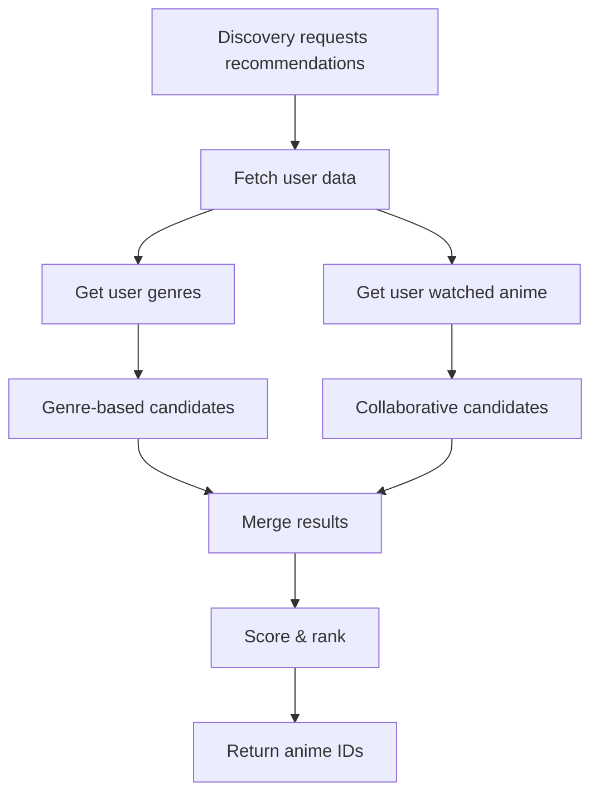
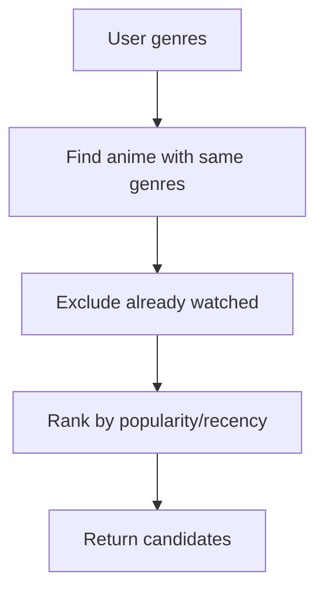
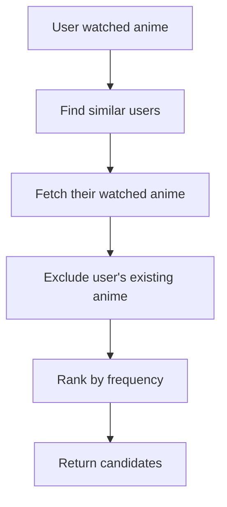

# Recommendation Module

## 1. Overview

The Recommendation module is responsible for generating personalized anime suggestions using a hybrid approach based on user preferences and behavior.

- What problem it solves:
  Helps users discover relevant anime tailored to their interests instead of generic browsing.

- Where it is used:
  Backend (recommendation engine), consumed by Discovery module

- Why it exists:
  To centralize recommendation logic and allow independent evolution from rule-based to advanced ML systems.

---

## 2. Scope

### Included

- Personalized recommendation generation
- Hybrid recommendation logic:
  - Genre-based filtering
  - Collaborative filtering (user behavior)

- Ranking and scoring of results

### Excluded

- Anime data fetching (handled by Anime module)
- UI aggregation (handled by Discovery)
- Notifications

---

## 3. User Flows

### Flow 1: Generate Recommendations



---

### Flow 2: Genre-Based Recommendation



---

### Flow 3: Collaborative Filtering (User Behavior)



---

## 4. Data Models (Schema)

### No direct tables required (V1)

### Uses:

- user_anime (watch history)
- user_genres
- anime
- anime_genres

---

### Optional (Future Optimization)

#### recommendation_cache

| Field      | Type      | Description       |
| ---------- | --------- | ----------------- |
| user_id    | UUID      | FK → users.id     |
| anime_id   | UUID      | Recommended anime |
| score      | Float     | Ranking score     |
| created_at | Timestamp | Cache timestamp   |

---

## 5. API Endpoints (Backend)

### GET /recommendations/:userId

- Returns ranked anime IDs

```json id="recjson01"
{
  "recommendations": [
    { "anime_id": "uuid", "score": 0.92 },
    { "anime_id": "uuid", "score": 0.87 }
  ]
}
```

---

## 6. Frontend Integration

### Indirect (via Discovery)

- Home page (recommended section)
- Anime detail page (similar anime)
- Explore page

---

### API Usage

- Discovery calls recommendation service
- Frontend never directly calls this module (recommended)

---

## 7. CMS Integration

### Not required (initially)

---

## 8. Business Logic

### Hybrid Recommendation Strategy

#### 1. Genre-Based

- Use user selected genres
- Fetch anime matching genres
- Remove already watched anime

#### 2. Collaborative Filtering

- Identify users with similar watch history
- Find anime commonly watched by those users
- Exclude user's existing anime

---

### Scoring Logic (Example)

Final Score =

- 60% Collaborative score
- 40% Genre relevance

---

### Ranking Rules

- Higher frequency → higher rank
- More recent/popular anime boosted
- Deduplicate results after merging

---

## 9. Real-Time Behavior

- Can be computed:
  - On-demand (V1)
  - Cached (V2)

- Future:
  - Background jobs
  - Precomputed recommendations

---

## 10. Error Handling

### Common Errors

- No user data
- Empty recommendations
- Data fetch failure

### Fallback

- Return trending anime

---

## 11. Security Considerations

- Requires authentication
- Validate user access
- Prevent data leakage between users

---

## 12. Edge Cases

- New user (no history)
- Sparse user data
- Highly niche preferences
- Duplicate recommendations
- Cold start problem

---

## 13. Dependencies

- UserAnime module
- Anime module
- Onboarding module (genres)
- Discovery module (consumer)
