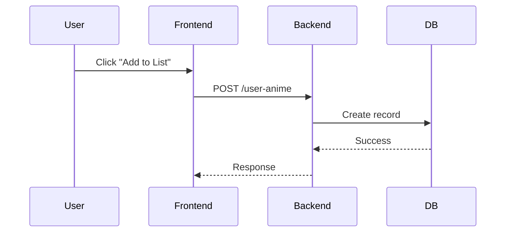
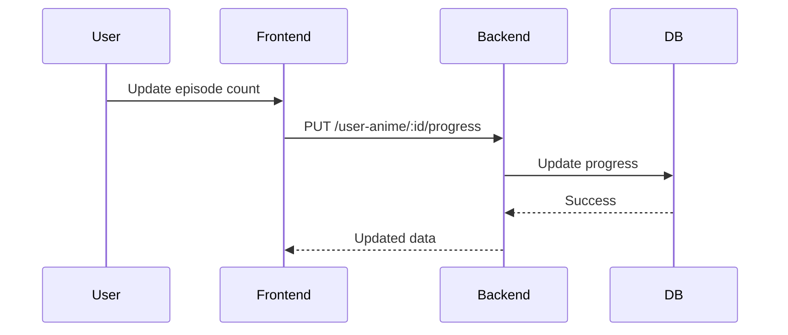
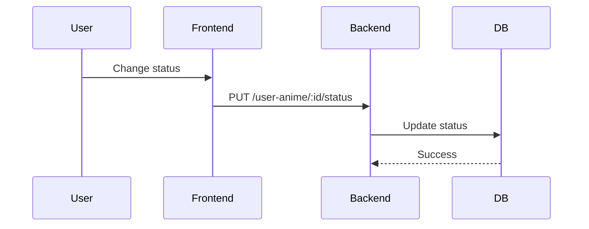
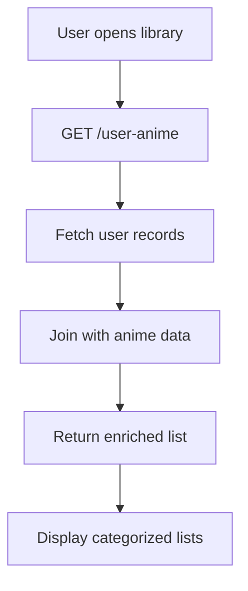
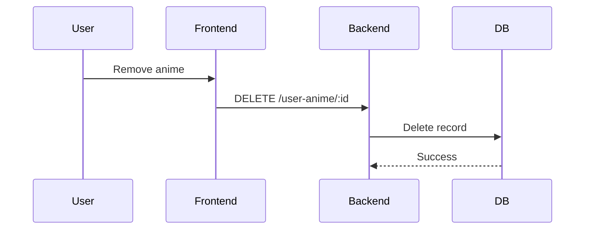

# UserAnime Module

## 1. Overview

The UserAnime module manages user-specific anime tracking including status, progress, and interactions.

- What problem it solves:
  Allows users to maintain a personal anime library and track watch progress.

- Where it is used:
  Frontend (library, tracking UI), Backend (user data), Analytics (future)

- Why it exists:
  To separate user behavior from static anime data.

---

## 2. Scope

### Included

- Add anime to user library
- Update status (Watching, Completed, Planned, Dropped)
- Track episode progress
- Remove anime
- Fetch user library

### Excluded

- Anime metadata
- Recommendations
- Notifications

---

## 3. User Flows

### Flow 1: Add Anime

---

### Flow 2: Update Progress

---

### Flow 3: Change Status

---

### Flow 4: Fetch User Library

---

### Flow 5: Remove Anime

---

## 4. Data Models (Schema)

### Tables

#### user_anime

| Field      | Type      | Description                              |
| ---------- | --------- | ---------------------------------------- |
| id         | UUID      | Primary key                              |
| user_id    | UUID      | FK → users.id                            |
| anime_id   | UUID      | FK → anime.id                            |
| status     | String    | Watching / Completed / Planned / Dropped |
| progress   | Integer   | Episodes watched                         |
| rating     | Float     | Optional                                 |
| created_at | Timestamp | Created time                             |
| updated_at | Timestamp | Last update                              |

---

### Relationships

- User → many user_anime
- Anime → many user_anime

---

## 5. API Endpoints (Backend)

### POST /user-anime

- Add anime to library

### GET /user-anime

- Get user library

### PUT /user-anime/:id/status

- Update status

### PUT /user-anime/:id/progress

- Update progress

### DELETE /user-anime/:id

- Remove anime

---

## 6. Frontend Integration

### Pages / Screens

- User library
- Anime detail (tracking section)

---

### Components

- Status selector
- Progress input
- Library tabs (Watching, Completed, etc.)
- Anime list (user-specific)

---

### State Management

- User anime list
- Status groups
- Progress state

---

### API Usage

- Fetch library on dashboard load
- Update on user actions

---

## 7. CMS Integration

### CMS Capabilities

- View user activity (optional future)

---

### CMS Views

- User anime analytics (future)

---

## 8. Business Logic

- One record per (user_id, anime_id)
- Progress ≤ total_eps
- Auto-complete:
  - If progress == total_eps → status = Completed

- Cannot update anime not in library

---

## 9. Real-Time Behavior

- Future: sync across devices

---

## 10. Error Handling

- Duplicate entry
- Invalid progress
- Unauthorized access
- Record not found

---

## 11. Security Considerations

- Requires JWT authentication
- Validate ownership of records
- Prevent tampering

---

## 12. Edge Cases

- Anime with unknown episode count
- Progress rollback
- Duplicate requests
- Race conditions on updates

---

## 13. Dependencies

- Authentication module
- Anime module
